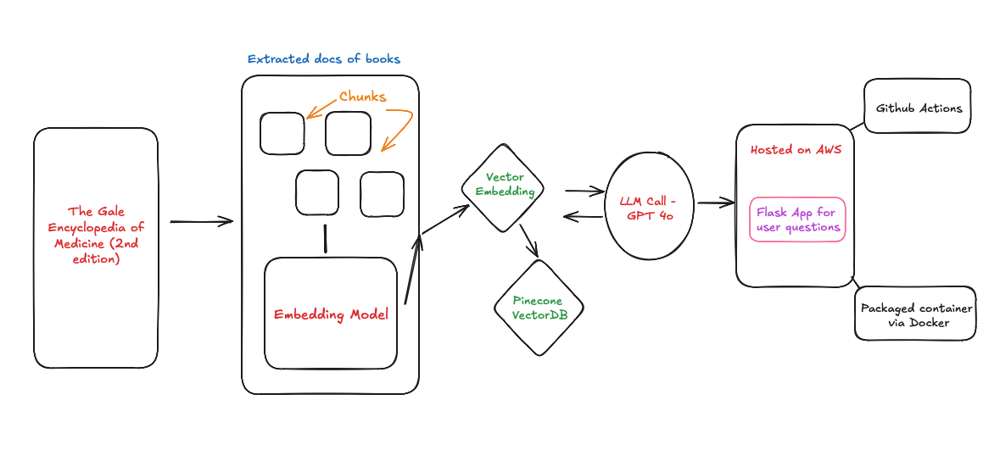

# Medical-Chatbot-End-to-End-Project

# How to run?

### Steps :

Clone the repository 

```bash
https://github.com/AnugyaSahu/Medical-Chatbot-End-to-End-Project
https://github.com/AnugyaSahu/Medical-End-to-End-Project.git
```

### 1. Create a conda environment after opening the repository 

```bash
conda create -n medibot python=3.11 -y
```

### 2. Install the requirements
```bash
pip install -r requirements.txt
```

### 3. Create a .env file in the root directory and add your Pinecone & openai(or other llm model):

```bash
PINECONE_API_KEY = "xxxxxxxx"
OPENAI_API_KEY = "xxxxxxx"
```

```bash
# run to store embeddings to pinecone
python store_index.py
```
```bash
# run
python app.py
```

Now
```bash
open up localhost:
```


